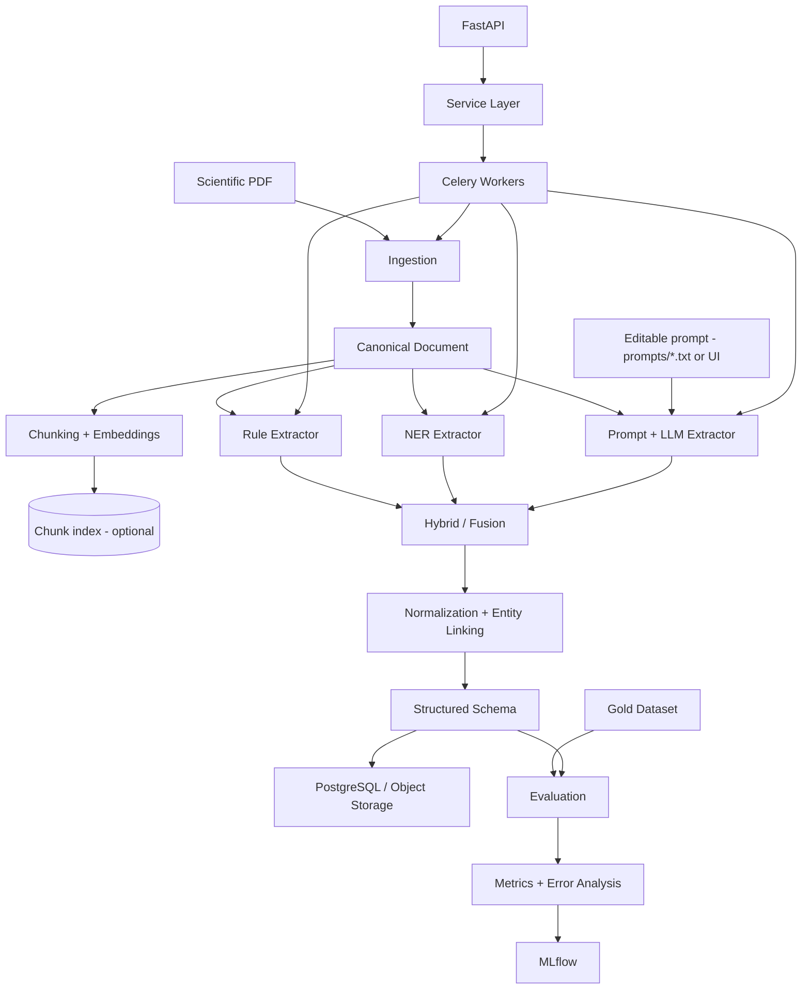

# Sci-Extract

## Scientific Literature to Structured Experimental Data

Sci-Extract is a modular pipeline for extracting structured experimental information from scientific papers. It is designed for chemistry and materials-science literature and supports multiple extraction strategies, provenance tracking, quantitative evaluation, and reproducible experiments.

The core objective is to transform:

```text
Scientific PDF
      ↓
Canonical Document
      ↓
Rule-based / NER / Prompt + LLM
      ↓
Normalization + Linking
      ↓
Structured Scientific Data
      ↓
Evaluation + MLflow
```

---

## Architecture



---

## Repository Structure

```text
sci-extract/
│
├── schemas/             # Extraction schemas and validation
├── storage/             # Database and object-storage layer
├── ingestion/           # PDF → canonical document
├── retrieval/           # Chunking, embeddings and retrieval
├── extractors/          # Rule, NER, Prompt+LLM and hybrid extraction
├── prompts/             # Editable extraction prompts (*.txt) for the Prompt + LLM extractor
├── normalization/       # Units and entity normalization/linking
├── evaluation/          # Gold data, metrics and error analysis
├── experiments/         # Reproducible experiments and MLflow
├── services/            # Application/service layer
├── api/                 # FastAPI routes
├── workers/             # Celery tasks and background processing
├── tests/               # Unit and integration tests
├── scripts/             # Utility and pipeline scripts
├── notebooks/           # Research and exploratory analysis
│
├── pyproject.toml
└── README.md
```

---

# Pipeline

## 1. Schema Definition

The schema defines the structure of the extracted scientific information.

Example:

```json
{
  "paper_id": "paper-001",
  "schema_version": "v2",
  "material": null,
  "precursors": [],
  "solvent": null,
  "temperature": null,
  "reaction_time": null,
  "pH": null,
  "synthesis_method": null,
  "steps": [],
  "characterization": [],
  "properties": []
}
```

Schemas provide:

- consistent output across extractors
- validation
- versioning
- easier storage
- comparable evaluation

The schema can evolve toward richer protocol-level structures as the research develops.

---

## 2. Storage

The storage layer separates scientific processing from persistence.

```text
PostgreSQL
├── papers
├── versions
├── blocks
├── chunks
└── extraction records

Object Storage
├── original PDFs
├── canonical documents
└── large artifacts
```

PostgreSQL handles structured metadata and relationships, while object storage handles large document artifacts.

---

## 3. Document Ingestion

The ingestion layer converts a PDF into a canonical representation.

```text
PDF
 │
 ├── PyMuPDF
 ├── GROBID
 └── OCR fallback
       ↓
Canonical Document
       ↓
Pages / Sections / Blocks / Tables / Figures
```

The canonical document provides a common representation for every downstream extractor.

This avoids having each extraction method independently parse the original PDF.

---

## 4. Chunking and Retrieval

The canonical document is divided into retrieval-friendly chunks.

```text
Canonical Document
       ↓
Section-aware segmentation
       ↓
Blocks / Paragraphs
       ↓
Chunks
       ↓
Embeddings
       ↓
Vector Retrieval
```

Chunks retain metadata such as:

```json
{
  "paper_id": "paper-001",
  "page": 4,
  "section": "Experimental Section",
  "block_id": "block-127",
  "text": "..."
}
```

This preserves the relationship between retrieved text and its original location.

Note: the LLM extractor does **not** use retrieval any more (see section 7) — the chunk
index remains available for search/analysis, but extraction sends the whole paper.

---

# Extraction

## 5. Rule-Based Extraction

The rule-based extractor provides a deterministic baseline.

It targets structured patterns such as:

```text
35 °C
10 min
0.2 mL
25 mM
0.4 M
50 mg
pH 7
```

### Advantages

- deterministic
- fast
- reproducible
- inexpensive
- easy to debug

### Limitation

Rules can detect values without understanding which chemical, step, or experimental protocol they belong to.

---

## 6. NER Extraction

The NER layer identifies scientific entities such as:

```text
AgNO3
HAuCl4
NaBH4
CTAB
CTAC
water
ethanol
TEM
UV-vis
```

Detected entities can later be mapped to the project schema.

NER focuses primarily on entity identification; contextual relationships and attributes are handled by later stages.

---

## 7. Prompt + LLM Extraction

> This replaced the earlier **RAG + LLM** extractor. Every paper is asked the same question,
> and a whole paper (≈20–60k characters) fits easily in the model's context window, so
> retrieval added failure points (embedding-model download, relevant sentences missed by
> top-k, four separate LLM calls) without adding information.

```text
Full paper text (CanonicalDocument, with [Page N] / [Section] markers, references removed)
  +
Editable extraction prompt  (prompts/*.txt, the UI text box, or the API "prompt" field)
       ↓
One LLM call (Anthropic Claude)
       ↓
JSON parsing (tolerates code fences / stray text; retried with feedback if invalid)
       ↓
Mapping onto SynthesisExtraction + evidence lookup in the document
       ↓
ExtractionResult  (prediction + provenance + llm_run {model, prompt, raw JSON})
```

Key points:

- **The prompt is data, not code.** Edit it in the Streamlit sidebar, drop a new `.txt`
  file into `prompts/`, set `EXTRACTION_PROMPT_FILE`, or send `"prompt"` to the API.
  The paper text is appended automatically; put `{document}` in the prompt to place it yourself.
- **The raw JSON is always kept** (`llm_run.output`, "LLM JSON" tab in the UI), whatever shape the
  prompt asks for. Keys that use the schema's names (`material`, `precursors`, `solvent`,
  `temperature`, `reaction_time`, `pH`, `synthesis_method`, `steps`, `characterization`,
  `properties`) are also mapped into `prediction`, so hybrid fusion, normalization and
  evaluation work unchanged.
- **Units** are written in the same spelling the rule extractor uses (`C`, `min`, `h`, `mM`, `uM`, `mL`…).
- **Evidence:** every LLM value is searched for verbatim in the paper; when found, the provenance
  records page, section and character span (confidence 0.8), otherwise a document-level note (0.6).
- **Reproducibility:** the prompt's hash is part of the extractor version
  (`llm@<model>+prompt-<sha>`), so a changed prompt is stored as a new run and never served
  from the result cache; the full prompt text is saved with every result.
- **Errors are shown, not hidden:** invalid key, unknown model, or an answer cut off by
  `max_tokens` produce a clear message in the UI; transient errors (rate limit, overload,
  network) and non-JSON answers are retried.

Presets shipped in `prompts/`:

| File | Output |
|---|---|
| `synthesis_extraction.txt` (default) | One JSON object in the project schema |
| `protocols_extraction.txt` | `{"protocols": [...]}` — one entry per experimental procedure (protocol-aware; kept in `llm_run.output`) |

The LLM should not be treated as the sole source of truth; its output is validated and evaluated against reference data.

---

## 8. Hybrid Extraction

The hybrid layer can combine:

```text
Rule-based
     +
NER
     +
Prompt + LLM
     ↓
Fusion
     ↓
Conflict Resolution
     ↓
Final Extraction
```

The goal is to combine deterministic signals with semantic/contextual extraction.

---

## 9. Normalization and Entity Linking

Raw extraction must be normalized before becoming a reliable scientific dataset.

Examples:

```text
35 °C
35°C
35 degrees C
```

→

```text
value = 35
unit = °C
```

Similarly:

```text
silver nitrate
AgNO3
AgNO₃
```

can be linked to a common canonical entity.

Normalization covers:

- units
- chemical names
- abbreviations
- aliases
- numerical representations
- entity identifiers

---

# Evaluation

## 10. Gold Dataset

A research system requires reference annotations rather than relying only on qualitative inspection.

```text
Scientific Papers
       ↓
Human Annotation
       ↓
Gold Dataset
       ↓
Predictions vs Reference
```

The gold dataset can contain:

- entities
- quantities
- units
- relationships
- experimental steps
- protocol context
- provenance

Multiple annotators can be used to measure agreement before adjudication.

---

## 11. Evaluation

The evaluation layer measures extraction quality quantitatively.

Standard metrics include:

```text
Precision = TP / (TP + FP)

Recall = TP / (TP + FN)

F1 = 2 × Precision × Recall
     -------------------------
       Precision + Recall
```

For scientific extraction, evaluation should go beyond entity detection.

### Entity-level

Was the entity detected?

### Attribute-level

Was the correct quantity or condition extracted?

### Relationship-level

Was the quantity associated with the correct entity?

### Context-level

Did the value belong to the correct experimental protocol?

### Unit-level

Are equivalent units handled correctly?

---

## Error Analysis

Typical error categories include:

```text
Entity missed
Entity hallucinated
Wrong quantity
Wrong unit
Wrong entity-value association
Wrong experimental context
Duplicate entity
Protocol mixing
Normalization error
Retrieval failure
Schema validation failure
```

Error analysis is used to identify where improvements are actually required.

---

# 12. MLflow Experiment Tracking

MLflow records the configuration and results of extraction experiments.

```text
Experiment
├── Dataset version
├── Extractor
├── Model
├── Prompt/configuration
├── Chunking parameters
├── Retrieval parameters
├── Metrics
└── Artifacts
```

This enables reproducible comparisons between:

```text
Rule-based
    vs
NER
    vs
Prompt + LLM
    vs
Hybrid
```

The objective is to make every reported result traceable to the configuration that produced it.

---

# 13. Application and Orchestration

The application layer exposes the pipeline through FastAPI and supports asynchronous processing with Celery.

```text
Client
  ↓
FastAPI
  ↓
Service Layer
  ↓
Celery Queue
  ↓
Worker
  ↓
Extraction Pipeline
  ↓
PostgreSQL / Object Storage
```

Redis can act as the Celery message broker.

Background processing is useful because PDF parsing, retrieval and LLM calls can be computationally expensive or slow.

---

# Protocol-Aware Extraction

A major challenge is that a scientific paper may contain multiple independent procedures.

For example:

```text
Paper
├── Gold seed synthesis
├── Gold bipyramid synthesis
├── Overgrowth
├── Kinetic study
└── Characterization
```

A flat result such as:

```json
{
  "temperature": 35,
  "reaction_time": 30
}
```

can lose critical context.

A more expressive representation is:

```text
Paper
├── Protocol 1
│   ├── reagents
│   ├── conditions
│   └── steps
│
├── Protocol 2
│   ├── reagents
│   ├── conditions
│   └── steps
│
└── Protocol 3
    ├── reagents
    ├── conditions
    └── steps
```

The long-term objective is to preserve:

```text
Entity
   ↓
Attribute
   ↓
Relationship
   ↓
Experimental Context
```

rather than extracting isolated facts.

---

# Example

A paper may contain:

```text
HAuCl4   → 25 mM
HAuCl4   → 50 mM
AgNO3    → 10 mM
NaBH4    → 25 mM

35 °C
80 °C

30 min
90 min
```

Detecting every value is not sufficient.

The system must determine which value belongs to which chemical and which experimental procedure.

This is why the project combines:

- canonical document representation
- retrieval
- multiple extraction strategies
- provenance
- normalization
- evaluation

---

# Running It

```bash
pip install -r requirements.txt
streamlit run frontend/app.py
```

1. Upload PDFs → **Process Documents**.
2. Sidebar: paste your Anthropic API key → **Apply** → **Load models** → pick a model
   (default `claude-sonnet-5-5`; override with `LLM_MODEL`).
3. Choose **Prompt + LLM** (or **Hybrid**), adjust the prompt if you like → **Run Extraction**.
4. Results: **LLM JSON** (the model's answer as-is), **Structured JSON** (full `ExtractionResult`),
   **Evidence**, **Raw Text**, **Metadata**. Both JSONs can be downloaded.

Command line: `python3 demo_extract.py paper.pdf [my_prompt.txt]` (needs `ANTHROPIC_API_KEY`).

API: `POST /papers/{id}/extract` with `{"extractor": "llm", "prompt": "...", "model": "..."}`
(`prompt`/`model` optional; `"rag_llm"` is still accepted as an alias of `"llm"`).

| Environment variable | Purpose | Default |
|---|---|---|
| `ANTHROPIC_API_KEY` | API key when none is entered in the UI | — |
| `LLM_MODEL` | Claude model id | `claude-sonnet-5-5` |
| `LLM_MAX_TOKENS` | Max output tokens | `16000` |
| `EXTRACTION_PROMPT_FILE` | Prompt file used by default | `prompts/synthesis_extraction.txt` |

---

# Research Workflow

```text
Papers
  ↓
Canonical Documents
  ↓
Gold Dataset
  ↓
┌─────────┬─────────┬─────────┐
│ Rules   │ NER     │ LLM     │
└────┬────┴────┬────┴────┬────┘
     └─────────┼─────────┘
               ↓
          Evaluation
               ↓
        Error Analysis
               ↓
            MLflow
               ↓
         Improve System
               ↓
          Re-evaluate
```

This creates a reproducible research loop:

**Build → Measure → Analyze → Improve → Re-measure**

---

# Technology Stack

| Layer | Technology |
|---|---|
| Language | Python |
| API | FastAPI |
| Background Jobs | Celery |
| Broker | Redis |
| PDF Processing | PyMuPDF |
| Scientific Parsing | GROBID |
| OCR | OCR fallback |
| Schemas | Pydantic |
| Database | PostgreSQL |
| Retrieval | Vector-store abstraction / pgvector |
| Extraction | Rules, NER, Prompt + LLM (Anthropic Claude) |
| Experiment Tracking | MLflow |
| Containerization | Docker |
| Version Control | Git / GitHub |

---

# Research Questions

The architecture supports experiments around:

1. How accurately can experimental information be extracted from scientific papers?
2. How well can extracted values be associated with the correct entities?
3. How sensitive is LLM-based extraction to the prompt?
4. Does Prompt + LLM improve contextual extraction compared with deterministic baselines?
5. Can hybrid extraction improve robustness?
6. Can the complete extraction process be evaluated and reproduced systematically?

---

# Future Work

- Protocol-level extraction
- Improved provenance
- Chemical entity linking
- Unit normalization
- Schema-constrained LLM output
- Prompt comparison experiments
- Gold annotation dataset
- Annotator agreement
- Relationship-level evaluation
- Unit-aware metrics
- MLflow benchmarking
- CSV/Excel export
- Human review interface
- Production monitoring

---

# Design Principles

### Structured
Define the target schema before extracting data.

### Contextual
Preserve relationships between entities, values and experimental procedures.

### Auditable
Maintain provenance back to the source document.

### Reproducible
Track datasets, models, configurations and metrics.

### Measurable
Evaluate extraction methods against reference annotations.

---

# Project Status

**Research / Active Development**

Sci-Extract is being developed as a modular research framework for scientific information extraction, with the architecture designed to support both experimental evaluation and eventual production deployment.
